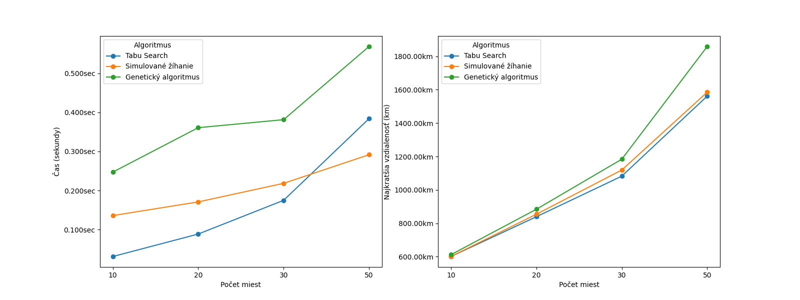
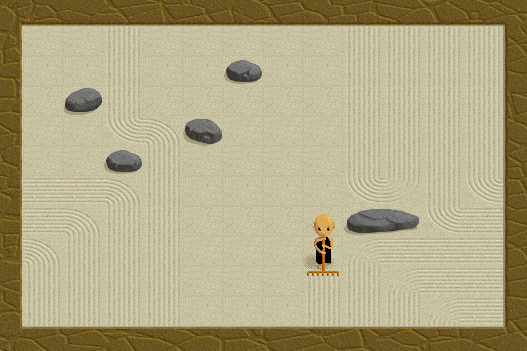
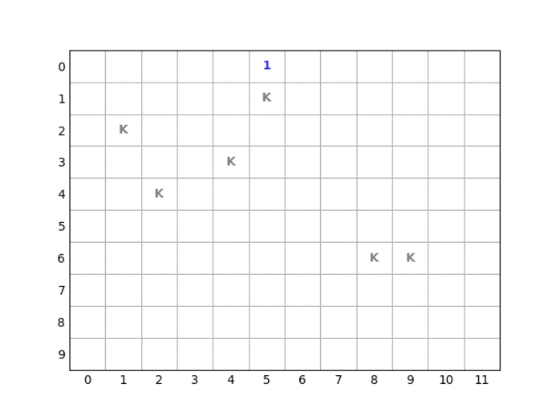
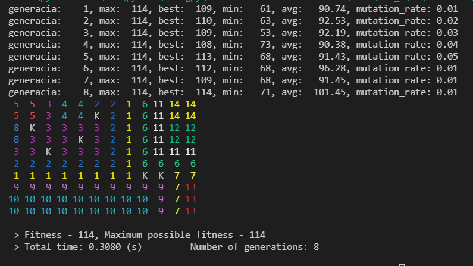
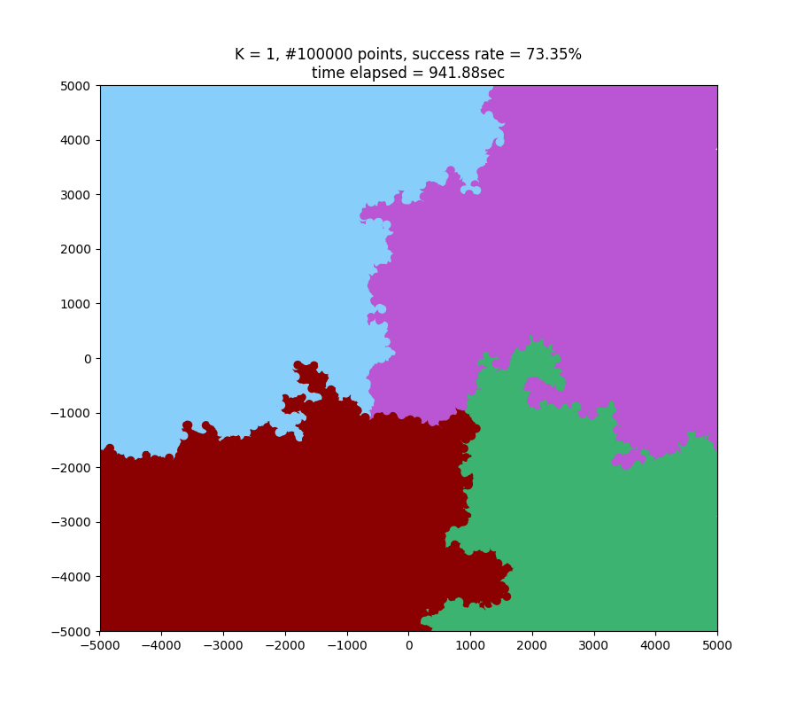
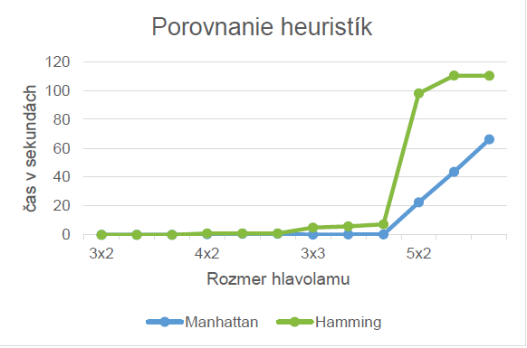

# Evolucne algoritmy

Evolucne algoritmy sluzia na prehladavanie a su vhodne na riesenie optimalizacnych uloh. Ja som riesil pomocou nich Problem obchodneho cestujuceho (TSP) a Zenovu zahradu (Zen's Garden).


## Travelling Salesman Problem

Zdrojovy kod - [TSP.py](evolucne_algoritmy/TSP.py)

[Dokumentacia](evolucne_algoritmy/TSP_dokumentacia.pdf)

Na vyriesenie tohto NP-tazkeho problemu som pouzil 2 horolezecke algoritmy - Zakazane prehladavanie (Tabu Search) a Simulovane zihanie (Simulated Annealing) a Geneticky algoritmus.

Pri rieseni problemu som zistil, ako velmi je dolezite nastavit parametre co najvhodnejsie pri jednotlivych algoritmoch.

Vsetky 3 algoritmy som porovnal a taktiez som implementoval vizualizaciu priebehu hladanie pomocou kniznice ```matplotlib```.


#### Porovnanie algoritmov




## Zenova zahrada

Zdrojovy kod - [zens_garden.py](evolucne_algoritmy/zens_garden.py)

Zen musi pohrabat celu svoju zahradku jednym tahom vzdy z okraja na iny okraj, pricom v zahradke sa nachadzaju prekazky. Tahat moze iba vertikalne alebo horizontalne a zmenit smer moze iba pri natrafeni na prekazku ci uz pohrabanu policko.

Dolezite bolo urcit fitness funkciu, vyber jedinca, krizenie a mutaciu pre spravne najdenie vysledku.



Implementoval som aj vizualizaciu riesenia cez kniznicu ```matplotlib``` a taktiez vysledok a informacie o generaciach su vypisane v konzolovej aplikacii.


#### Vizualizacia riesenia



#### Riesenie a progress v konzoli



# Klasifikacia bodov

Klasifikacia bodov podla k najblizsich (kNN algoritmus).

Zdrojovy kod - [klasifikator.py](klasifikacia/klasifikator.py)

[Dokumentacia](klasifikacia/dokumentacia.pdf)

#### Priklad klasifikacie pri 100 tisic bodoch



# Prehladanie stavoveho priestoru

Na najdenie riesenia niektorych problemov, ktore sa daju reprezentovat stavom, sa daju pouzit algoritmy prehladavajuce stavy.

Ja som pouzil riesenie N-Hlavolamu pomocou A* algoritmu s roznymi heuristikami (Manhattanovska vzdialenost a Hammingova vzdialenost).

Taktiez som riesil aj problem Eulerovho kona na sachovnici.

Zdrojove kody
- [hlavolam.py](stavovy_priestor/hlavolam.py)
- [hlavolam.c](stavovy_priestor/hlavolam.c)
- [eulerovkon.py](stavovy_priestor/eulerovkon.py)

[Dokumentacia hlavolamu](stavovy_priestor/dokumentacia.pdf)

#### Porovnanie heuristik pri rieseni hlavolamu

