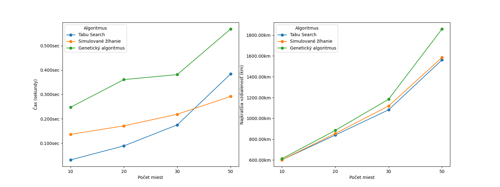
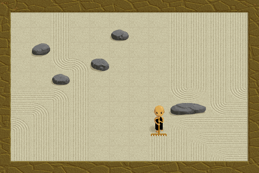
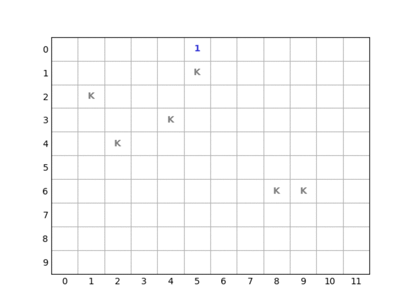
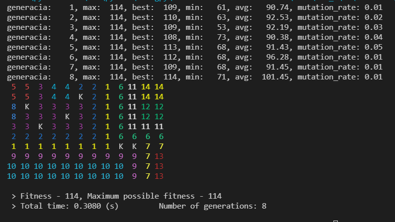
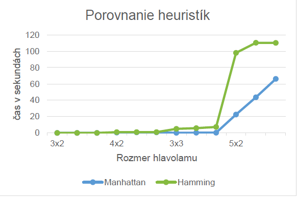

# Evolutionary algorithms

Evolutionary algorithms can be used to solve optimization problems. I've used EA to solve Travelling Salesman Problem (TSP) and Zen's Garden.


## Travelling Salesman Problem

Source code - [TSP.py](evolucne_algoritmy/TSP.py)

[Documentation in Slovak](evolucne_algoritmy/TSP_dokumentacia.pdf)

To find feasible solution for this NP-hard problem, I've used 2 hill-climbing algorithms (Tabu Search & Simulated Annealing) and Genetic algorithm (GA).

I tested the program many times to find optimal settings for each algorithm.

All 3 algorithms were compared and solution is visualized using ```matplotlib``` library.


#### Algorithms comparison




## Zenova zahrada

Zdrojovy kod - [zens_garden.py](evolucne_algoritmy/zens_garden.py)

Zen musi pohrabat celu svoju zahradku jednym tahom vzdy z okraja na iny okraj, pricom v zahradke sa nachadzaju prekazky. Tahat moze iba vertikalne alebo horizontalne a zmenit smer moze iba pri natrafeni na prekazku ci uz pohrabanu policko.

Dolezite bolo urcit fitness funkciu, vyber jedinca, krizenie a mutaciu pre spravne najdenie vysledku.



Implementoval som aj vizualizaciu riesenia cez kniznicu ```matplotlib``` a taktiez vysledok a informacie o generaciach su vypisane v konzolovej aplikacii.


#### Vizualizacia riesenia



#### Riesenie a progress v konzoli



# Klasifikacia bodov

Klasifikacia bodov podla k najblizsich (kNN algoritmus).

Zdrojovy kod - [klasifikator.py](klasifikacia/klasifikator.py)

[Dokumentacia](klasifikacia/dokumentacia.pdf)

#### Priklad klasifikacie pri 100 tisic bodoch


# Prehladanie stavoveho priestoru

Na najdenie riesenia niektorych problemov, ktore sa daju reprezentovat stavom, sa daju pouzit algoritmy prehladavajuce stavy.

Ja som pouzil riesenie N-Hlavolamu pomocou A* algoritmu s roznymi heuristikami (Manhattanovska vzdialenost a Hammingova vzdialenost).

Taktiez som riesil aj problem Eulerovho kona na sachovnici.

Zdrojove kody
- [hlavolam.py](stavovy_priestor/hlavolam.py)
- [hlavolam.c](stavovy_priestor/hlavolam.c)
- [eulerovkon.py](stavovy_priestor/eulerovkon.py)

[Dokumentacia hlavolamu](stavovy_priestor/dokumentacia.pdf)

#### Porovnanie heuristik pri rieseni hlavolamu

