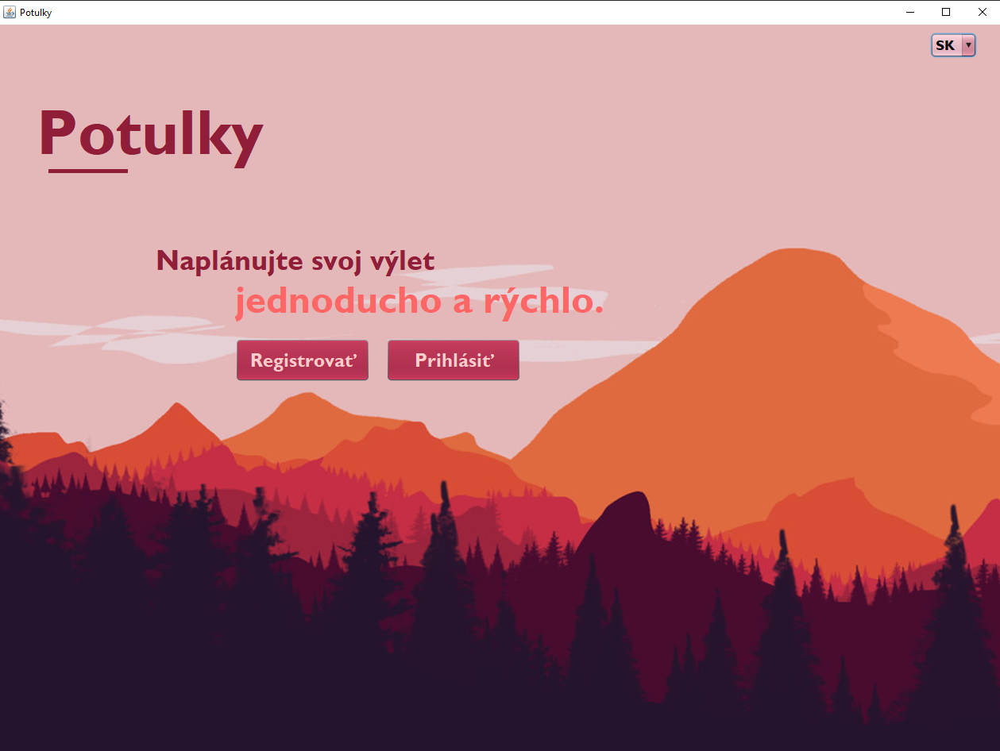
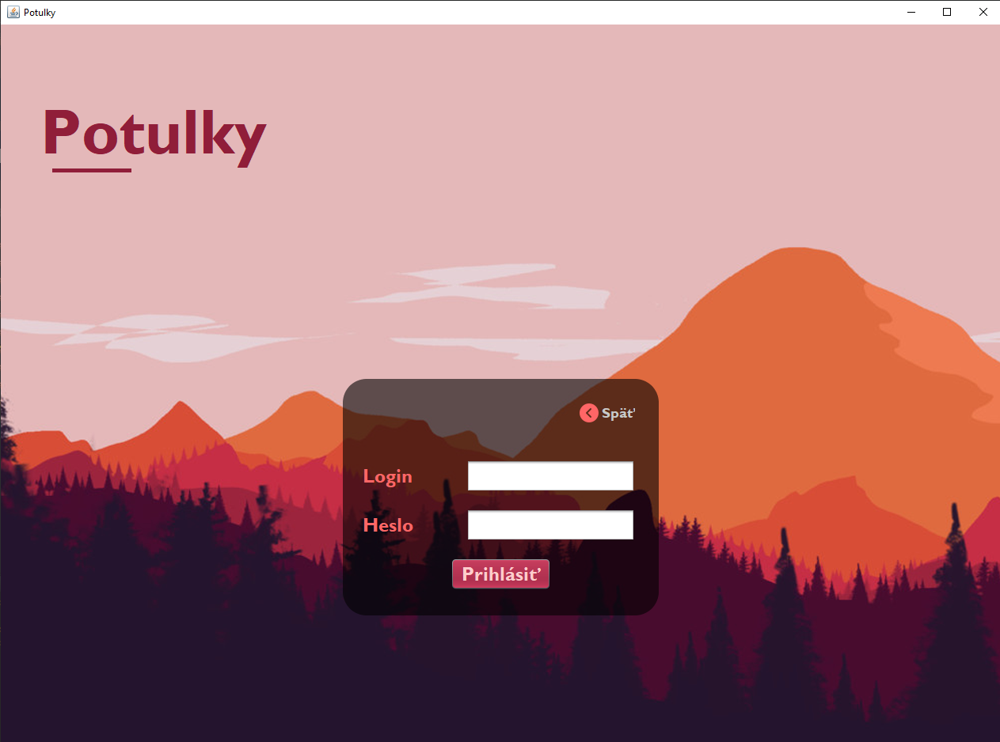
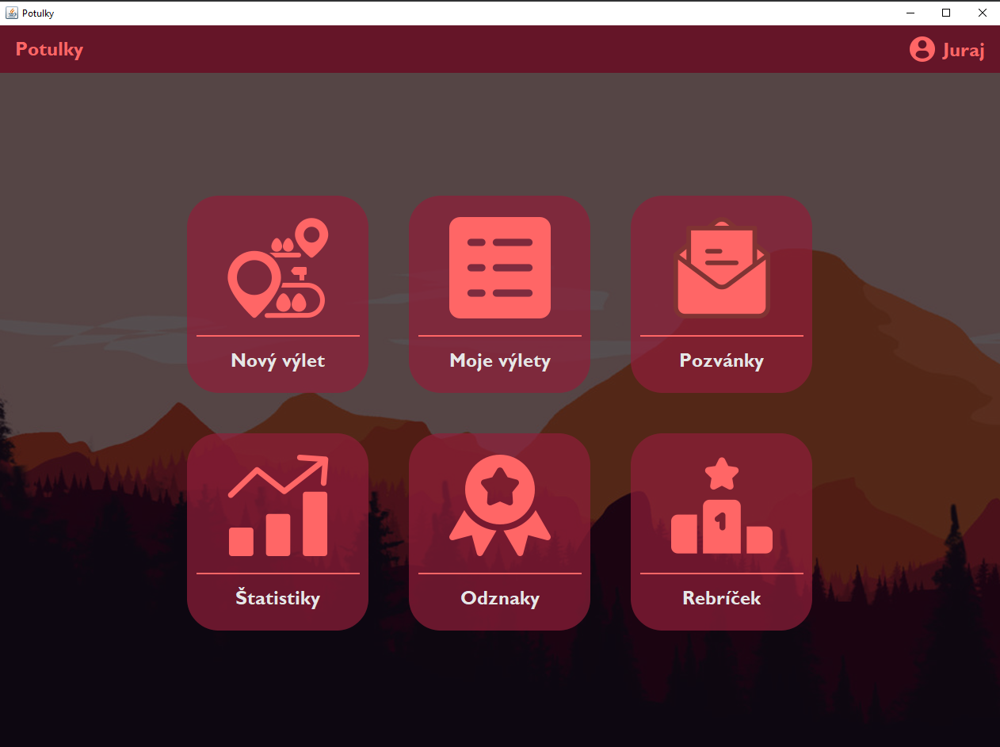
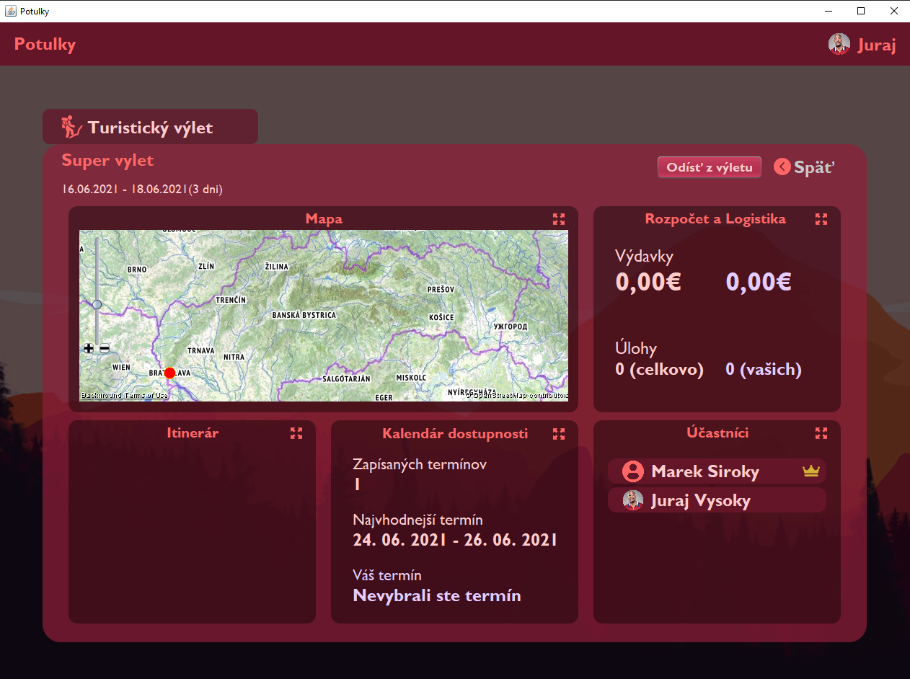
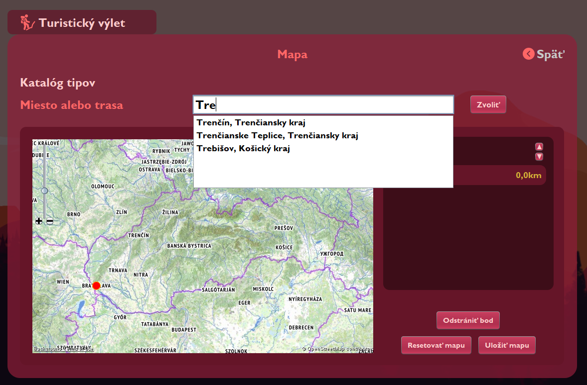
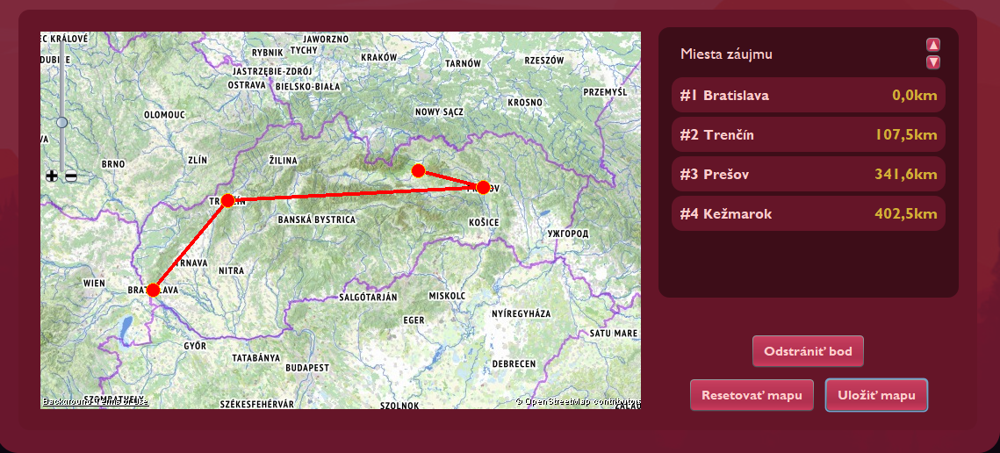
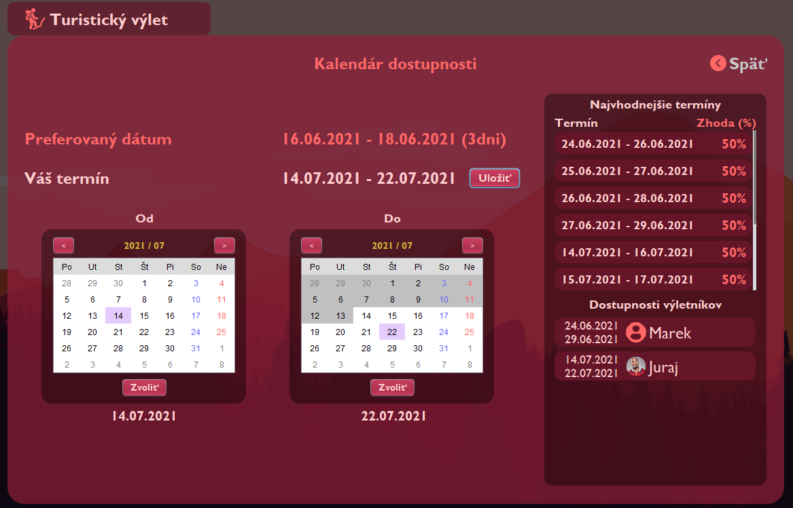
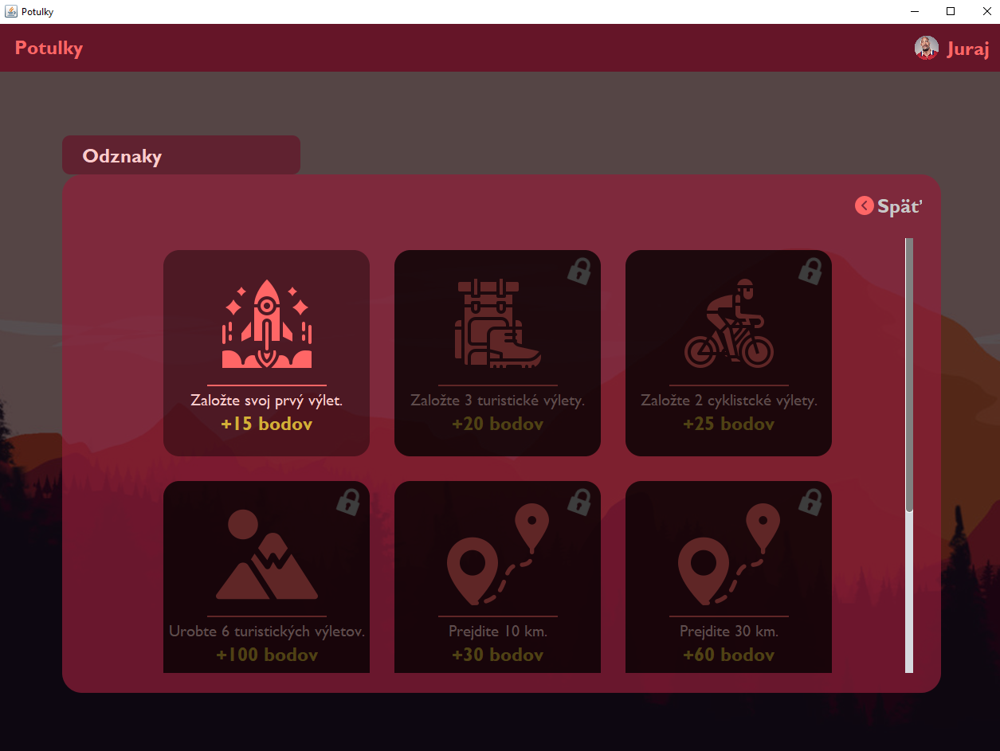
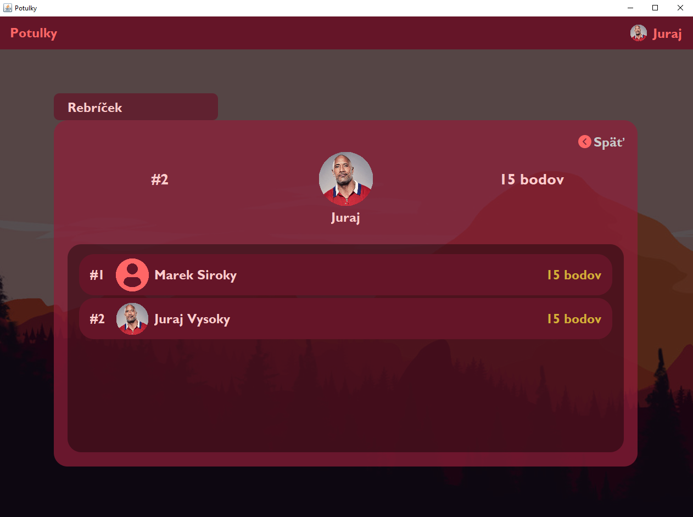
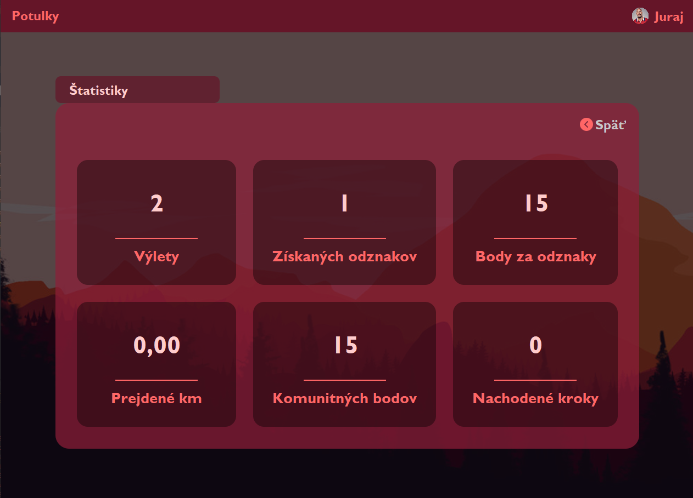

# Potulky

Potulky je desktopova aplikacia v Jave 8 s vlastnym Swing GUI, ktora umoznuje planovanie turistickych, cyklistickych a vodackych vyletov.

## Uvodna obrazovka

## Prihlasovanie

## Hlavne menu

## Panel vyletu

## Mapa vyletu s volenim miest a automatickym doplnanim

## Prihlasovanie terminov a generovanie najvhodnejsieho terminu

## Pozyvanie do vyletu

## Komunitne odznaky davaju body do rebricka

## Komunitny rebricek

## Statistiky uzivatela

