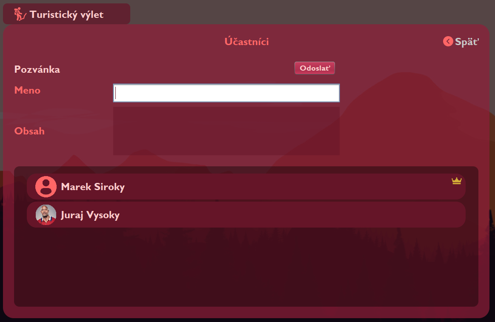

# Potulky

Potulky is desktop application with custom Swing GUI developed in Java 8. It allows users to plan their tourist, bicycle or canoeing trips.

## Splash page

## Login

## Main menu

## Panel vyletu

## Mapa vyletu s volenim miest a automatickym doplnanim

## Prihlasovanie terminov a generovanie najvhodnejsieho terminu

## Pozyvanie do vyletu

## Komunitne odznaky davaju body do rebricka

## Komunitny rebricek

## Statistiky uzivatela

